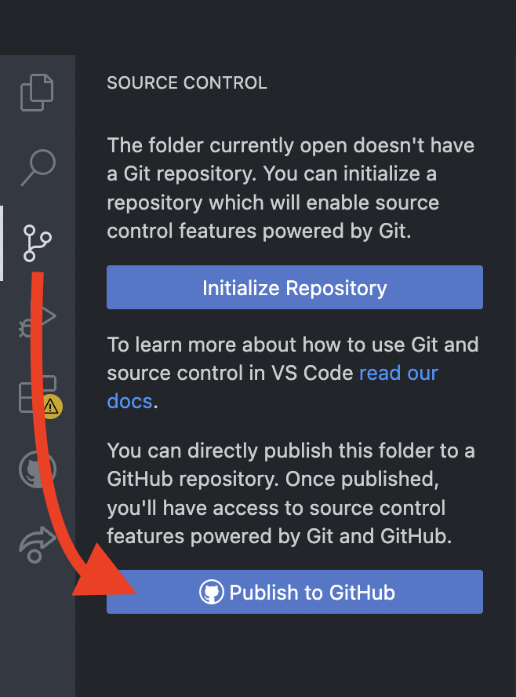
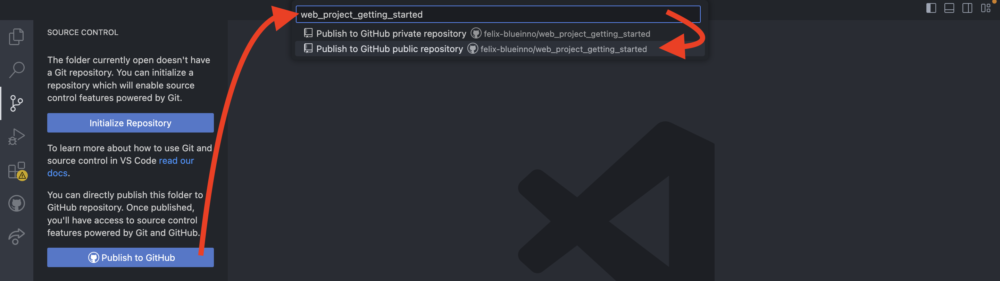
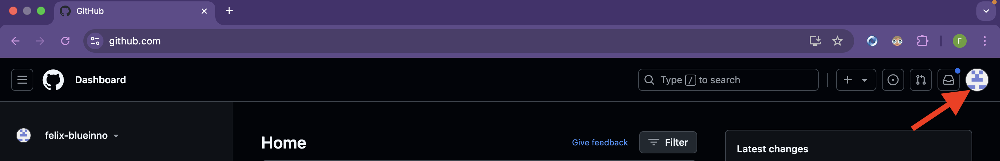
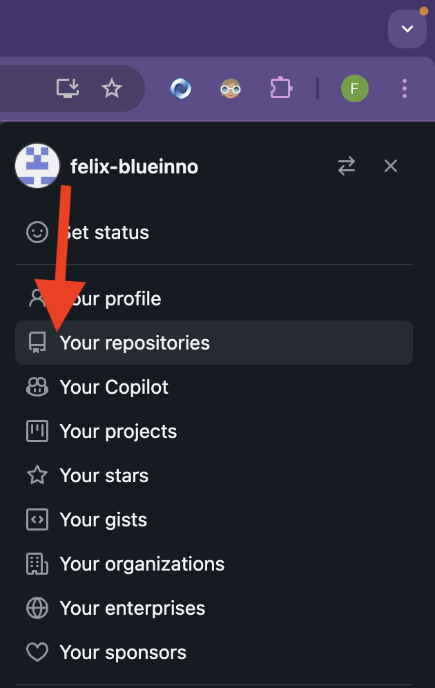
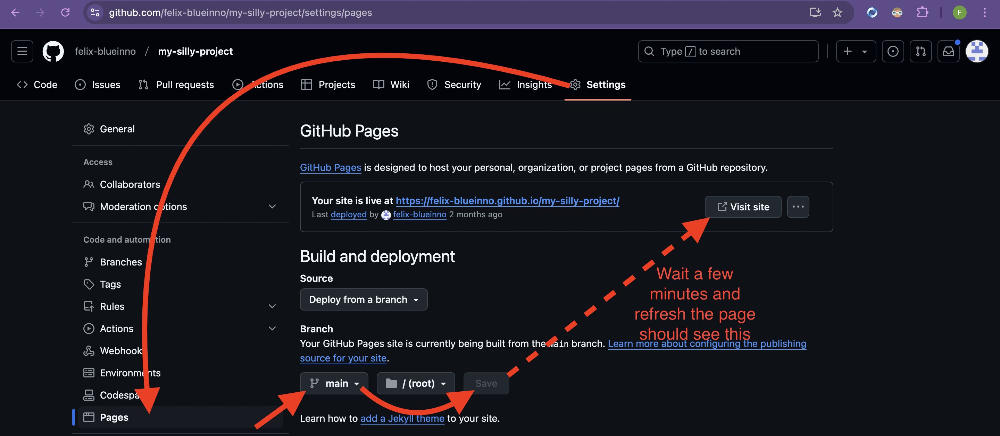

# How to Run

## Install dependencies

In the terminal, run the following command to install the dependencies:

```bash
npm i
```

## Start Watching for Tailwind CSS Changes

In the terminal, run the following command to start watching for changes in the `input.css` file:

```bash
npm run watch
```

## Start the Website Locally

1. Go to `public/index.html`.
2. Right-click and select "Open with Live Server".

## Design Systems

- [TailwindCSS](https://tailwindcss.com/)
- [DaisyUI](https://daisyui.com/)

## Upload to GitHub

1. Upload button
   
2. Set the project name and make it public.
   

> For free GitHub account, you must set repository as `public` to publish your website with GitHub.

## Publish Your Website

Go to [GitHub](https://github.com/) and login with your account

1. Find your avatar
   
2. Find "Your repositories".
   
3. Publish your website
   

4. You should see the link provided by GitHub.

!!! Note: Remeber to append "public" at the end of the link.
!!! Note: E.G. https://felix.github.io/project_name/public
!!! Note: If you have HTML other than `index.html` under public folder, append the file name after "/public".
!!! Note: E.G. https://felix.github.io/project_name/public/login
